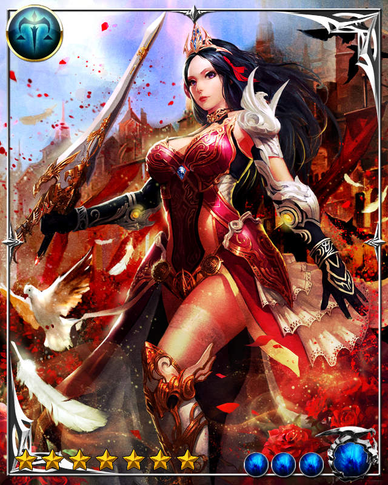

# Illyria

[](https://travis-ci.org/XadillaX/illyria2) [](https://coveralls.io/r/XadillaX/illyria2) [](http://david-dm.org/XadillaX/illyria2)

The next generation Illyria RPC SDK for node.js in Huaban with ❤️.

## Installation

```shell
$ npm install --save illyria
```

## Usage

### Server

First you should create a server.

```javascript
var illyria = require("illyria");
var server = illyria.createServer(options);
```

or

```javascript
var server = new illyria.Server(options);
```

> options is an optional parameter and may contain:
>
> * `maxRetries`: default to 10
> * `retryInterval`: default to 5000
> * `maxListeners`: maximum server event / client event listeners count, default to 10
> * `port`: optional, you may specify it in `listen`
> * `host`: optional, you may specify it in `listen`
> * `...`: other options for [net.Socket](https://iojs.org/api/net.html#net_new_net_socket_options)

After the server is created, you may expose or overwrite a module of its events to clients:

```javascript
server.expose("module", {
    "method": function(req, resp) {
        // ... do sth ...
        resp.send(RESPONSE_MESSAGE);
    }
}, [OPTIONS]);
```

> The code above will expose (may overwrite previous module `"module"`) the whole module `"module"` with only one method `"method"` to clients.
> 
> And the method `"method"` will do something and send `RESPONSE_MESSAGE` back to client who made this request.
>
> `req` is [Request](#request) which will be metioned after and `resp` is [Response](#response) which will be metioned later.
>
> **Attention:** `OPTIONS` is an optional parameter that is an instance of object.
>
> `OPTIONS`:
>
> * `alias`: You may specify some alias rules for `module` or `methods`. For an example, if your module name is `fooBar` and the `OPTIONS` is `{ alias: [ { module: "upperCamel" } ] }`, the module `FooBar` will be exposed at the same time while `fooBar` is exposed;

When all modules are exposed, you can let the server listen to a certain port:

```javscript
server.listen([SERVER_PORT], [SERVER_HOST], callback);
```

> `SERVER_PORT` and `SERVER_HOST` are optional when you specified in constructor's `option` parameter. `callback` is the callback function when your server listened successfully.
>
> **Caution:** `SERVER_PORT` should be an instance of `Number` and `SERVER_HOST` should be an instance of `String`.

#### With Zookeeper

You can use zookeeper to manage server nodes:

```javascript
var server = illyria.createServer(OPTIONS, ZOOKEEPER_OPTIONS);
```

> If you had specified `ZOOKEEPER_OPTIONS`, illyria will use zookeeper to manage this node.
>
> `ZOOKEEPER_OPTIONS`:
> * `connectString`: a connect string or a connect string's array. Refer [here](https://www.npmjs.com/package/node-zookeeper-client#documentation).
> * `root`: this node's root path. Defaults to `"/illyria"`.
> * `prefix`: the node name's prefix. Defaults to `"/HB_"`. So the default whole path is `"/illyria/HB_#{node sort}"`.
> * `...`: other options refer [here](https://www.npmjs.com/package/node-zookeeper-client#client-createclientconnectionstring-options).

##### What Does This Do?

When zookeeper is specified, the server will register for a temporary node under zookeeper.

The content data of that node will be a string like:

> {host},{port},{currentClientCount}

For an example, when a server of `192.168.1.88:1234` is created, and zookeeper options is `{ connectString: foo, root: "/illyria", prefix: "/HB_" }`, a node named `/illyria/HB_0000000001` will be created, and the content will be:

> 192.168.1.88,1234,0

After a new client is connected, the content will be changed to

> 192.168.1.88,1234,1

#### Request

Request will be passed in the exposed server methods as `req`.

This kind of object has functions below:

* `params()`: get the whole param body of message received from client.
* `param(key, defaultValue)`: if `params()` returns a JSON object, this function may return the value of a certain key with a default value if it has no such key.

#### Response

Response will be passed in the exposed server methods as `resp`.

This kind of object has functions below:

* `json(data)`: send a JSON data back to the request client.
  - if there's a key values `status` and its boolean value is `false`, server will send back an error message to client with the message in key `msg`.
  - if there's a key values `err` or `error`, server will send back an error message to client with this `err` or `error` object.
  - otherwise, server will send back a normal json message to client.
* `send(data)`: send a normal message equals to `data` back to the request client.
* `error(err)`: send an error message with `err` back to the request client.

> **Tip:** You may get the client `socket` wrapper object through both `req.socket` or `resp.socket`.

### Client

Your client should be created at first:

```javascript
var illyria = require("illyria");
var client = illyria.createClient(SERVER_HOST, SERVER_PORT, options);
```

or

```javascript
var client = new illyria.Client(SERVER_HOST, SERVER_PORT, options);
```

> Be careful that `SERVER_PORT` must be an instance of `Number`.
>
> options is an optional parameter and may contain:
>
> * `runTimeout`: dafault to 10000 (ms)
> * `maxRetries`: default to 10
> * `retryInterval`: default to 5000 (ms)
> * `...`: other options for [net.Socket](https://iojs.org/api/net.html#net_new_net_socket_options)

Then you may connect to the server:

```javascript
client.connect(function() {
    // DO SOMETHING AFTER CONNECTED
    // ...
});

client.on("error", function(err) {
    console.log(err);
});
```

#### Events

##### Error

```javascript
client.on("error", function(err) {});
```

##### Try Reconnect

```javascript
client.on("tryReconnect", function(after) {});
```

##### Connected

```javascript
client.on("connected", function() {});
```

#### Send a Message to RPC Server

```javascript
client.send("module", "method", DATA, function(err, data) {
    console.log(err, data);
});
```

#### Send a Cast Message to RPC Server

```javascript
clisent.cast("module", "method", DATA, function(err) {
    console.log(err);
});
```

#### Get Current Connect Status

```javascript
client.connectStatus(); ///< DISCONNECTED, etc.
```

> `"module"` and `"method"` are specified by server via `server.expose()`.
>
> `DATA` may be a number, string, JSON object and so on.
>
> After client received response from RPC server, the callback function will be called. When the server response an error message, the `err` is the responsed error. Otherwise, `data` will be responsed via server's `resp.send()`.

#### With Zookeeper

You can use zookeeper to connect to server automatically with simple load balancing:

```javascript
var server = illyria.createClient(OPTIONS);
```

> The `OPTIONS` is the same as it mentioned above on client section.
>
> But it must has a part called `zookeeper`.
>
> `zookeeper`:
> * `connectString`: a connect string or a connect string's array. Refer [here](https://www.npmjs.com/package/node-zookeeper-client#documentation).
> * `root`: this node's root path. Defaults to `"/illyria"`.
> * `prefix`: the node name's prefix. Defaults to `"/HB_"`. So the default whole path is `"/illyria/HB_#{node sort}"`.
> * `...`: other options refer [here](https://www.npmjs.com/package/node-zookeeper-client#client-createclientconnectionstring-options).
>
> eg.
>   `{ zookeeper: { connectString: "xxx" } }`

##### What Does This Do?

When zookeeper is specified, the client will connect to zookeeper and find all registered servers information which are specifed via root and prefix.

Then it will choose a least connection server to connect.

## Benchmark

See [wiki/benchmark](../../wiki/Benchmark) or may [wikis/benchmark](../../wikis/Benchmark) for more information.


